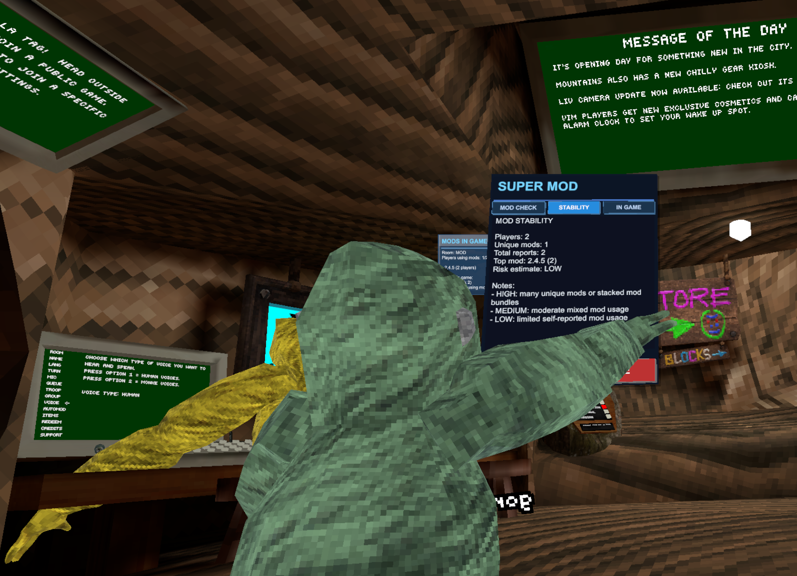

# Super Mod Checker

  

  

  
   <em>In-game glass HUD overlay and tablet menu</em>

Super Mod Checker is a BepInEx plugin for Gorilla Tag that shows room-level mod information inside a handheld in-game tablet.

It reads each player's Photon custom property `mods`, aggregates the values, and shows counts by mod name.

## Eye Glass + Ocular HUD

Super Mod Checker includes a built-in **Eye Glass** — a transparent glass overlay that functions as an ocular piece directly inside your Oculus headset. It floats in your field of view at all times and immediately flags modded players the moment they are detected, without needing to open the tablet. Designed for Oculus / Steam VR, the Eye Glass renders in world-space so it appears inside the headset and not just on your desktop mirror.

## What It Does

- Shows a world-space tablet UI in your right hand.
- Includes an always-on **Eye Glass** HUD that acts as an in-headset ocular display, instantly detecting and surfacing modded players inside the Oculus Steam UI.
- Lists reported mods in your current room.
- Includes tabs for:
  - Mod Check
  - Stability
  - In Game Errors
- Supports refresh and close actions on the tablet.
- Writes runtime telemetry and events to a JSONL log file for diagnostics.

## Requirements

- Gorilla Tag (Steam or Oculus install)
- BepInEx 5.4.23.5

## Simple Install (Users)

1. Install BepInEx 5.4.23.5 into your Gorilla Tag folder.
2. Copy `supamodcheck.dll` into `BepInEx/plugins/`.
3. Launch Gorilla Tag.
4. Press the right controller A button to toggle the tablet.

Typical Gorilla Tag paths:

- Steam: `C:/Program Files (x86)/Steam/steamapps/common/Gorilla Tag/`
- Oculus: `C:/Program Files/Oculus/Software/Software/another-axiom-gorilla-tag/`

## Controls

- A button: Show/Hide tablet
- B button: Cycle tab (when tablet is visible)
- Physical tablet buttons:
  - REFRESH: reload current tab data
  - CLOSE: hide tablet

## Log File Behavior

The plugin creates and appends this file automatically:

- `BepInEx/supamodcheck-log.jsonl`

You do not need to create the file manually.

Events written include:

- `game_start`, `game_stop`
- `telemetry` (heartbeat)
- `room_join`, `room_leave`
- `mods_snapshot`
- `input_a_press`, `input_b_press`
- `menu_shown`, `menu_hidden`
- `manual_refresh`

## Important Notes

- This tool only shows mods that are actually reported in Photon custom properties under key `mods`.
- If a mod does not publish its value there, it cannot be listed to which I could use mroe help here, adding more mod names to the 3 arrays in the core mod file. 
- Room data is aggregated by mod name and count, not by player identity.

## Troubleshooting

If tablet does not appear:

1. Confirm `supamodcheck.dll` is in `BepInEx/plugins/`.
2. Check `BepInEx/LogOutput.log` for plugin load errors.
3. Confirm you are using BepInEx 5.4.23.5.
4. Press A after entering game world (not only in menus).

If mod list is empty in-room:

1. Verify you are connected to a Photon room.
2. Verify other clients actually publish `mods` to Photon custom properties.

## Credits

- Original concept credit: Moon
- Current maintained/rebuilt plugin: this repository

## Disclaimer

This project is not affiliated with, endorsed by, or sponsored by Another Axiom LLC.
